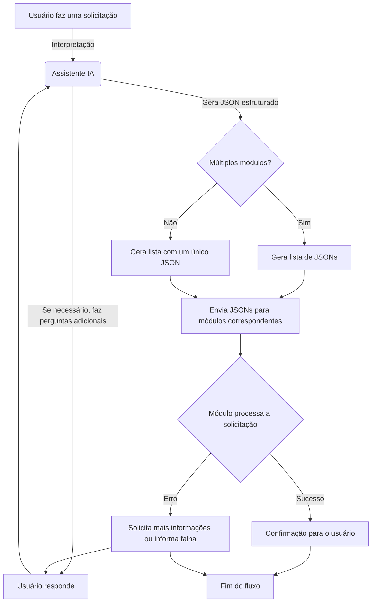

# 📌 Documentação da Geração do JSON para os Módulos do Sistema

## 📚 Visão Geral

Este documento define como deve ser enviado o json para identificar e enviar as informações para os módulos disponíveis no sistema, suas ações e a estrutura dos JSONs que o assistente deve gerar ao interpretar as mensagens dos usuários.

---

## 📝 Estrutura Padrão do JSON

Cada solicitação gerada pelo assistente deve seguir esta estrutura:

[{
"module": "NOME_DO_MODULO",
"action": "ACAO_A_EXECUTAR",
"resume_message": "Resumo curto da ação solicitada",
"data": {
"...dados relevantes...",
"keys": ["...palavras-chave para indexação e busca..."]
}
}]

Caso haja múltiplas ações ou módulos envolvidos na mesma solicitação, o assistente deve gerar uma lista de JSONs:

[
{
"module": "MODULO_1",
"action": "ACAO_1",
"resume_message": "Resumo da ação 1",
"data": { "..." }
},
{
"module": "MODULO_2",
"action": "ACAO_2",
"resume_message": "Resumo da ação 2",
"data": { "..." }
}
]

---

## 🔹 EXEMPLO: Módulos e Ações

### 🗒️ **Módulo: ANOTATIONS** (Anotações)

📌 Responsável por armazenar, recuperar e atualizar anotações.

**Ações Disponíveis:**

- **CREATE** → Criar uma nova anotação.
- **SEARCH** → Buscar anotações existentes.
- **UPDATE** → Atualizar uma anotação específica.
- **DELETE** → Remover uma anotação.

**Exemplos:**
✅ **Criar uma anotação:**

{
"module": "ANOTATIONS",
"action": "CREATE",
"resume_message": "Criar anotação sobre acidente de carro",
"data": {
"DESCRIPTION": "Carro Honda Fit preto placa AKG9837 envolvido em acidente",
"CAR": "HONDA FIT PRETO",
"PLATE": "AKG9837",
"EVENT": "ACCIDENT",
"keys": ["CAR", "PLATE", "ACCIDENT", "COLLISION"]
}
}

✅ **Buscar anotações:**

{
"module": "ANOTATIONS",
"action": "SEARCH",
"resume_message": "Buscar informações sobre o acidente do usuário",
"data": {
"SEARCH_QUERY": "ACCIDENT CAR",
"keys": ["CAR", "ACCIDENT", "COLLISION"]
}
}

---

### 📅 EXEMPLO: **Módulo SCHEDULING** (Agendamentos)

📌 Gerencia eventos e compromissos.

**Ações Disponíveis:**

- **CREATE** → Criar um agendamento.
- **SEARCH** → Buscar compromissos futuros ou passados.
- **UPDATE** → Modificar um compromisso existente.
- **DELETE** → Cancelar um compromisso.

**Exemplos:**
✅ **Criar um agendamento:**

{
"module": "SCHEDULING",
"action": "CREATE",
"resume_message": "Criar um agendamento de reunião",
"data": {
"PARTICIPANTS": ["Henrique", "Rafael"],
"DATE": "2025-02-25T14:00:00Z",
"keys": ["REUNIAO", "AGENDAMENTO", "PARTICIPANTES", "DATA"]
}
}

✅ **Consultar agendamentos futuros:**

{
"module": "SCHEDULING",
"action": "SEARCH",
"resume_message": "Buscar reuniões futuras",
"data": {
"FILTER_DATE": "FUTURE",
"keys": ["REUNIAO", "AGENDAMENTO", "FUTURO"]
}
}

---

### 🛒 Exemplo: **Módulo SHOPPING_LIST** (Lista de Compras)

📌 Gerencia listas de compras.

**Ações Disponíveis:**

- **ADD_ITEMS** → Adicionar itens à lista de compras.
- **REMOVE_ITEMS** → Remover itens da lista.
- **SEARCH** → Buscar itens cadastrados na lista.
- **CLEAR** → Limpar a lista.

**Exemplos:**
✅ **Adicionar itens à lista:**

{
"module": "SHOPPING_LIST",
"action": "ADD_ITEMS",
"resume_message": "Adicionar itens à lista de compras",
"data": {
"ITEMS": ["LEITE", "OVOS", "PÃO"],
"keys": ["COMPRAS", "LISTA", "MERCADO"]
}
}

✅ **Consultar itens na lista:**

{
"module": "SHOPPING_LIST",
"action": "SEARCH",
"resume_message": "Buscar itens na lista de compras",
"data": {
"keys": ["COMPRAS", "LISTA", "MERCADO"]
}
}

---

## 🎯 Regras Importantes

- Sempre pergunte se houver dúvidas antes de gerar o JSON.
- Nunca invente informações – apenas organize e categorize.
- Retorne sempre um JSON bem estruturado e válido.
- Para buscas, use palavras-chave relevantes no campo `keys`.
- Se houver múltiplas ações ou módulos, crie uma lista de JSONs.

---

## 🎯 Diagrama de fluxo

